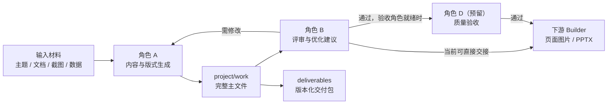

# Huawei PPT Skill Workspace

面向华为风格高层汇报材料的生成、评审、验收与迭代工作区。

本项目围绕 `huawei_ppt_master` 构建一条可复用的 PPT 生产链路：将用户提供的主题、文档、截图或参考材料，转化为结构化大纲、逐页文案、页面设计说明和 `deck_spec.json`，并通过独立评审与质量验收控制主题污染、事实误用、版式失真和下游生成风险。

## 当前能力

当前主生成 Skill 入口为：

```text
skills/huawei_ppt_master/SKILL.md
```

其入口声明版本为 `0.3.7-deck-spec-proof-contract`，核心能力包括：

- 生成 PPT 大纲、逐页文案、页面设计说明与 `deck_spec.json` 草案；
- 以结论先行、工程化表达、克制商务视觉组织高层汇报内容；
- 按主题路由加载领域知识包，默认避免将 AI 算力/昇腾/NVIDIA 内容污染到无关主题；
- 从 PPT 图片、模板、文本和数据材料中抽取可复用的视觉、结构、表达与方法论规律；
- 约束 `chart_type`、`layout_pattern`、来源证据与视觉可执行性，为后续页面图片或 PPTX 生成提供稳定输入。

当前工作区已具备以下角色能力：

| 角色 | Skill | 职责 | 当前状态 |
|---|---|---|---|
| A / 生成 | `huawei_ppt_master` | 生成大纲、文案、设计说明和 deck spec | 已具备 |
| B / 优化评审 | `huawei_ppt_skill_optimizer` | 评审输出、归因问题、提出 patch proposal 与回归建议 | 已具备 |
| D / 质量验收 | `huawei_ppt_qa_reviewer`（预留） | 对内容、版式及生成成品执行独立验收 | 待补齐 Skill 入口 |
| C / PPTX Builder | 下游构建环节 | 将确认后的结构化输入生成页面图片或正式 PPTX | 本仓库未提供独立 Skill 入口 |

## 设计原则

### 内容原则

- 结论先行，每页只服务一个核心判断；
- 图表、流程、架构与数据必须服务论证，不作为装饰；
- 未获得可信材料时，不编造数据、案例、市场判断或产品参数；
- 需要最新事实、政策、规格或市场信息时，先核验来源再进入交付物。

### 视觉原则

- 以白、灰、黑为主体，以华为红精准强调关键判断、关键证据或关键路径；
- 页面应呈现业务判断、证据关系和工程机制，而不是机械堆叠卡片；
- 正文页避免厚重红色底栏、大面积装饰背景和营销发布会风格；
- 版式规则见 `skills/huawei_ppt_master/templates/visual_rules.md` 与 `skills/huawei_ppt_master/visual_patterns/`。

### 学习边界

- 参考截图可用于学习配色、结构、标题句式和图解方法；
- 截图中的数字、客户案例或行业结论不得自动视为事实依据；
- 单份材料的局部写法不得直接升格为全局规则；
- 新规律须经过评审和回归验证后再沉淀到 Skill。

## 工作流程



标准生成交付通常包含：

1. `outline_v*.md`：结构化大纲；
2. `page_copy_v*.md`：逐页文案；
3. `page_design_v*.md`：页面设计说明；
4. `deck_spec_v*.json`：下游构建输入，`deck_spec_field_dictionary.md`：deck_spec.json字段字典 ；
5. `source_evidence_manifest_v*.*`：涉及事实或来源时的证据清单；
6. `project/handoff/A_to_B.md`：生成到评审的交接单；
7. `deliverables/` 下的版本化交付目录或 zip 包。

## 目录结构

```text
feishu-bot4-workspace/
|-- AGENTS.md                         # 角色职责与写入边界
|-- README.md                         # 项目入口说明
|-- skills/
|   |-- huawei_ppt_master/            # 生成主 Skill
|   |   |-- SKILL.md                  # 唯一执行入口
|   |   |-- core/                     # 流程、路由、契约与防过拟合规则
|   |   |-- templates/                # 文案、图表和通用视觉规则
|   |   |-- visual_patterns/          # 可复用页面版式模式
|   |   |-- domain_profiles/          # 条件触发领域知识包
|   |   |-- methodology_patterns/     # 方法论与论证结构
|   |   `-- eval/                     # 自检与回归规则
|   |-- huawei_ppt_skill_optimizer/   # 优化评审 Skill
|   `-- huawei_ppt_qa_reviewer/       # 独立验收角色预留目录，待补齐入口
|-- project/
|   |-- input/                        # 任务输入材料
|   |-- work/                         # 当前任务完整工作文件，可随任务更新
|   |-- review/                       # 评审报告、issue、backlog、patch proposal
|   |-- handoff/                      # 角色间交接与状态
|   `-- PPT_image/                    # 已生成页面图片及对标样张
|-- deliverables/                     # 可交付、可归档的版本化产物
|-- tests/                            # 项目级验收提示与测试清单
`-- tmp/                              # 临时脚本、参考版式与分析中间材料
```

## 关键文件

| 文件 | 用途 |
|---|---|
| `AGENTS.md` | 定义角色 A/B 的职责和写入边界，执行前必须遵循 |
| `skills/huawei_ppt_master/SKILL.md` | 生成任务唯一入口及最高优先级规则 |
| `skills/huawei_ppt_master/core/output_contracts.md` | 大纲、文案、设计和 deck spec 的输出契约 |
| `skills/huawei_ppt_master/core/topic_router.md` | 主题识别与领域包加载规则 |
| `skills/huawei_ppt_master/core/anti_overfit_rules.md` | 主题污染和参考材料过拟合控制 |
| `skills/huawei_ppt_master/templates/visual_rules.md` | 视觉规则、降噪约束与负面禁止风格 |
| `skills/huawei_ppt_master/eval/` | 生成结果的自检与回归门禁 |
| `project/handoff/status.md` | 最近一次写入的任务状态快照 |

## 快速开始

### 1. 生成内容包

```text
请启用 huawei_ppt_master。
基于我提供的材料，生成《XXX》的华为风格高层汇报 PPT 输入包。
受众：技术高层 / 业务决策人。
页数：10 页。
要求：输出大纲、逐页文案、页面设计说明和 deck_spec.json；
没有来源依据的数据请标注待补材料，不生成正式 PPTX。
```

### 2. 评审并提出优化建议

```text
请启用 huawei_ppt_skill_optimizer。
评审 project/work/ 下当前交付物，检查主题污染、证据完整性、
chart_type/layout_pattern 字段边界和版式可执行性；
输出问题清单、改进 backlog 与 patch proposal，不直接修改主 Skill。
```

### 3. 执行独立验收（待补齐角色 D 后）

```text
请启用 huawei_ppt_qa_reviewer（需先具备可用的 SKILL.md 入口）。
对本次交付的内容结构、视觉规则符合性、数据来源边界和下游构建可用性进行验收，
给出是否可以进入页面图片或 PPTX 生成阶段的结论。
```

## 交付与协作约定

### 工作区与交付包

- `project/work/` 保存当前任务的完整主文件，任务切换或返工时可能更新；
- `deliverables/` 保存面向交付或归档的版本化结果，应作为历史成果读取入口；
- 超过 10 页的交付可按页码拆包，但 `project/work/` 应保留完整版本；
- 涉及来源证据的任务，应随交付包提供证据清单或来源说明。

### 写入边界

按 `AGENTS.md` 执行：

- 角色 A 只写生成工作区、A 到 B 交接状态和交付包；
- 角色 B 只写评审工作区和 B 到 A 交接内容；
- 角色 B 对主 Skill 的修改必须以 patch proposal 提出，经人工确认后再合入；
- 正式 PPTX 生成不属于 `huawei_ppt_master` 的默认职责。

## 当前演进重点

项目当前已从“生成 PPT 内容”进入“控制结构化交付质量与视觉一致性”的阶段。后续重点应聚焦：

1. 保持 `SKILL.md`、`VERSION.md`、`CHANGELOG.md` 与 README 的版本描述同步；
2. 将 deck spec 字段合法性、主题污染与来源证据检查进一步脚本化；
3. 持续用页面图片对标结果迭代视觉规则，但只沉淀经过验证的通用规律；
4. 衔接稳定的下游 Builder，将通过验收的结构化输入转换为正式 PPTX；
5. 以真实交付样例扩充回归集，验证不同主题下的通用性与风格稳定性。

## 注意事项

- 本项目生成的是 PPT 内容与构建输入，未经明确确认不直接生成正式 PPTX；
- 主题相关知识只在命中条件时加载，不应无故迁移到其他题目；
- 参考视觉材料只用于风格和结构学习，不为事实结论背书；
- 开始任务前先阅读 `AGENTS.md` 与目标 Skill 的 `SKILL.md`，并以其规则为准。
